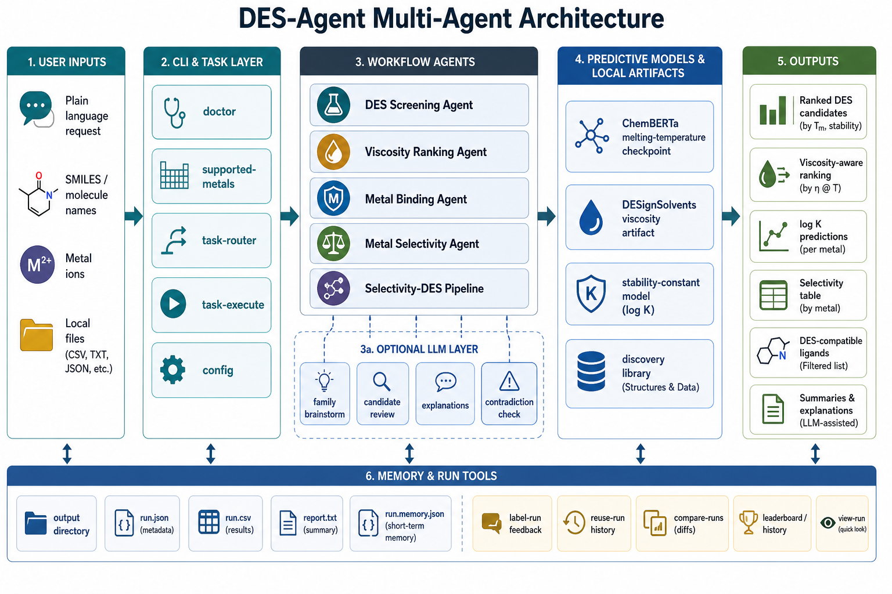

# DES-Agent Architecture

This diagram summarizes the main user entry points, workflow agents, predictive models, memory tools, and output artifacts in DES-Agent.

The system starts from plain-language requests, SMILES inputs, metal ions, or local files. The CLI and task layer route those inputs into DES screening, viscosity-aware ranking, metal-binding, metal-selectivity, or selectivity-DES workflows. Optional LLM roles assist with brainstorming, candidate review, explanations, and contradiction checks. Local model artifacts and run-memory files keep the system usable offline and reproducible across runs.

## New Modules (2026)

**`des_multi_agent/chemistry/partner_registry.py`**
Builds the known-compound registry (curated `common_names.json` ∪ auto-role-tagged `experimental.json`) and exposes `is_known()`, `structural_sanity()`, and `known_partner_menu(role, limit)` for reality-anchored partner proposals.

**`des_multi_agent/chemistry/claim_grounding.py`**
The single LLM-agnostic surface for chemistry grounding. Source-side: `structural_facts(smiles).as_prompt_block()` injects computed H-bond and coordination facts into prompts. Output-side: `GroundingVerdict` (verified/contradicted/unverifiable) from four checkers (family, DES plausibility, coordination, selectivity) and `PartnerVerdict` (known/novel_plausible/novel_implausible) from `ground_partner_reality`. Also exposes `ground_ligand_reality(metal_ion, smiles)` — the metal-binding variant; drops proposals with invalid SMILES, zero donor atoms, or structural sanity failures.

**`des_multi_agent/chemistry/name_resolution.py`**
Resolves common molecule names to canonical SMILES via `artifacts/molecule_names/common_names.json`. Used by all CLI entry points; falls back to treating the input as SMILES if no name match.

**`des_multi_agent/trajectory.py`**
Workflow-agnostic readable-trajectory layer. `TopEntry` / `CycleSnapshot` / `SearchTrajectory` frozen dataclasses capture per-cycle search state (shortlist, entrants/dropouts, family ledger, convergence). `shortlist_delta` computes label-set differences between cycles. `format_trajectory_report` renders a full Markdown narrative (`trajectory.md`); `format_trajectory_console` renders a compact per-cycle stderr trace. `write_trajectory_artifact` and `write_trajectory_json_artifact` both write atomically via `NamedTemporaryFile` + `Path.replace`, producing `trajectory.md` and `trajectory.json` respectively. All three iterative workflows (`multi_cycle.py`, `metal_binding_selectivity.py`, `selectivity_des_pipeline.py`) build snapshots inside their loops (best-effort, `try/except`) and attach a `SearchTrajectory` to their outcome; the CLI emits the console trace to stderr and writes both artifacts when `--output-dir` is set. `SearchTrajectory.total_cycles` counts actual iterations run, not snapshots captured.

**`des_multi_agent/server.py`**
Thin FastAPI REST wrapper. Exposes three endpoints: `GET /health` (liveness), `POST /search` (DES screening via `run_search_report`), `POST /metal-binding` (stability-constant prediction via `run_metal_binding_workflow`). Start with `python -m des_multi_agent.server [--host HOST] [--port PORT]`; importable as `from des_multi_agent.server import app` for embedding in notebooks or other services. Swagger UI at `/docs`.

## Chemical-Awareness Layer (2026-07)

Six features that accumulate domain knowledge within and across iterative screening runs, making each subsequent cycle and run chemically smarter.

**H-bond complementarity ranking (`orchestrator.py` → `chemistry/hbond.py`)**
After ML predictions and uncertainty annotation, `_apply_hbond_bias` calls `rank_by_hbond(component_a, candidates)` and applies a ±0.10 ranking adjustment proportional to `(composite_score − 0.5) × 0.20`. Well-matched H-bond partners rise; mismatched ones fall. The bias is deterministic and LLM-agnostic.

**Near-miss analogue expansion (`orchestrator.py`, `workflows/metal_binding_screen.py`)**
`_generate_analogue_candidates` now expands not only confirmed hits but also near-misses — candidates whose score falls within a window of the DES/binding threshold (default 15 K for DES, 0.5 log-units for metal binding). Near-miss analogues are tagged `source="near_miss_analogue"` and rationale notes the distance to threshold. These probe the productive chemical neighbourhood more precisely than pure heuristic brainstorming.

**UCB1 family scoring (`multi_cycle.py`, `workflows/metal_binding_screen.py`)**
`_family_ucb_scores(hits, fails, C=1.4)` computes a UCB1 score per family: `hit_rate + C × √(log(N_total) / n_family_trials)`. Families are saturated when UCB < 0.5 with ≥5 trials — much less aggressive than the previous fixed hit-rate threshold. The LLM brainstorm context now receives a ranked UCB table ("worth exploring further" vs. "depleted") instead of a flat saturation list.

**Adaptive transform selection (`analogue_expansion.py`, `multi_cycle.py`, `workflows/metal_binding_screen.py`)**
`generate_analogues_tagged(smiles, max_n, transform_weights)` returns `(smiles, transform_name)` pairs and re-orders transforms by descending weight. Cross-cycle tracking accumulates per-transform hit/fail counts; a Laplace-smoothed hit rate (`(h+1)/(h+f+2)`) is computed at the start of each cycle and passed as `transform_weights`. Transforms that historically produce hits are applied first.

**Functional-group frequency SAR (`multi_cycle.py`, `orchestrator.py`)**
`StructuralFacts.family_features` tags (e.g. `polyol`, `amide`, `carboxylic_acid`) are accumulated as hit-weighted and fail-weighted counters (`fg_hit_counts`, `fg_fail_counts`) across cycles. Tags with ≥2 trials are ranked by hit rate and injected into the brainstorm context as "prefer" and "avoid" sub-family SAR signals, providing finer-grained guidance than family-level labels alone.

**Cross-run persistence (`memory_schema.py`, `run_memory.py`, `multi_cycle.py`)**
`RunMemory` carries six new optional fields: `accumulated_family_scores`, `accumulated_family_hit_counts`, `accumulated_family_fail_counts`, `scaffold_counts`, `fg_hit_counts`, `fg_fail_counts`. `MultiCycleOutcome` exposes all five accumulated dicts so callers can serialize them. `build_run_memory` accepts them as keyword arguments; `parse_run_memory` restores them on load. `build_chemistry_advisor_memory_notes` surfaces the top productive families and FG SAR as narrative notes read by the next run's LLM context.

## Metal-Ligand Anchoring Layer (2026-07)

Four additions that anchor metal-binding LLM proposals to real chemistry, mirroring the DES partner reality-anchoring pattern.

**`known_ligand_menu` (`partner_registry.py`)**
`known_ligand_menu(metal_ion, limit=15)` scores every registry molecule (common_names.json ∪ experimental.json) with ≥1 donor atom using `rule_based_log_k`, sorts descending by predicted log K, and returns the top-N as `MenuEntry` objects whose `role` field carries a coordination summary (e.g. `"bidentate (N,O)"`). The scored list is computed once per metal ion via `_scored_ligand_entries` (`@lru_cache(maxsize=32)`).

**Ligand menu injection (`llm/prompts.py`, `llm/base.py`)**
`ligand_brainstorm_prompt` and `ligand_selectivity_brainstorm_prompt` accept an optional `known_ligand_menu` list; when non-empty, it is rendered before the constraints block as a ranked anchor list instructing the LLM to "prefer these or close analogues." `brainstorm_ligands` and `brainstorm_ligands_selectivity` in `base.py` compute the menu before each LLM call and pass it through.

**`ground_ligand_reality` (`claim_grounding.py`)**
Output-side gate returning a `PartnerVerdict`: invalid SMILES → `drop`; known compound → `keep` (status=`known`); `structural_sanity` failure → `drop`; zero donor atoms → `drop`; otherwise `keep` (status=`novel_plausible`). Never raises; exceptions fall back to `novel_plausible/keep`.

**Reality gate in metal workflows (`metal_binding_screen.py`, `metal_binding_selectivity.py`)**
After each LLM brainstorm, `ground_ligand_reality` is called for every LLM-sourced proposal. Proposals with `disposition=drop` are removed from the candidate list; a `[GROUNDING] Ligand dropped (reality): …` warning is appended to `all_warnings`.

## Diversity & Accuracy Improvements (2026-07)

**Tanimoto diversity penalty (`orchestrator.py`)**
`_apply_tanimoto_diversity_penalty` runs after `_apply_hbond_bias` each cycle. It builds Morgan fingerprints (radius=2, 2048-bit) for all DES-negative prior evaluations and computes max Tanimoto similarity for each new annotated result. When max similarity ≥ 0.70, a penalty of `0.10 × (max_sim − 0.70) / 0.30` is subtracted from `ranking_score` (clamped to 0.0). DES-positive prior results are never included in the fingerprint reference set.

**JSON trajectory export (`trajectory.py`, `cli.py`)**
`write_trajectory_json_artifact(output_dir, traj)` writes `trajectory.json` alongside `trajectory.md` using an atomic `NamedTemporaryFile` → `Path.replace` write. Content is `json.dumps(dataclasses.asdict(traj), indent=2, sort_keys=True)`. The CLI calls it in `_emit_trajectory()` with an `OSError` fallback that prints a warning to stderr rather than failing the run.
